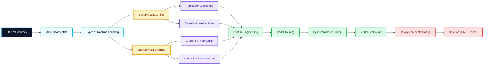

<!-- ================== MACHINE LEARNING NOTES REPOSITORY README ================== -->

  

<h1 align="center">🤖 Machine Learning Notes — Beginners to Advanced</h1>

A structured, concept-first and practice-driven repository for mastering  
<b>Machine Learning</b> from fundamentals to real-world deployment.

---

## 🔥 Repository Stats

<!-- Stars -->

<!-- Forks -->

<!-- Watchers -->

<!-- Downloads -->

---

## 🚀 What’s Inside?

| Level | Topics Covered |
|------|----------------|
| 🔹 Fundamentals | ML Overview, Types of ML, Use-Cases |
| 📊 Data Prep | Data Cleaning, EDA, Feature Engineering |
| 📐 Mathematics | Linear Algebra, Probability, Statistics |
| 🧠 Algorithms | Regression, Classification, Clustering |
| ⚙️ Model Tuning | Bias-Variance, Cross-Validation |
| 📈 Evaluation | Accuracy, Precision, Recall, F1, ROC |
| 🚀 Deployment | Pipelines, APIs, Model Serving |
| 📦 Libraries | NumPy, Pandas, Scikit-Learn, TensorFlow |

---
🧠 Why Learn Machine Learning?

✔ Powers modern AI systems

✔ High-demand career skill

✔ Used in finance, healthcare, marketing, IT
✔ Backbone of Data Science & AI

---
## 🎯 Objectives of This Repository

- Build **strong conceptual clarity** in Machine Learning  
- Understand **why & when** to use specific algorithms  
- Learn **end-to-end ML workflow** (data → model → deployment)  
- Bridge the gap between **theory and real-world implementation**  
- Prepare learners for **industry roles & interviews**

---

## 🌟 Importance of Machine Learning

- 🔹 Backbone of modern **AI & Data Science**
- 🔹 Powers systems like **recommendation engines, fraud detection, NLP**
- 🔹 Enables **data-driven decision making**
- 🔹 High-demand skill across industries (IT, Finance, Healthcare, Marketing)
- 🔹 Foundation for **Deep Learning & Generative AI**

---

## 📦 What This Repository Covers

| Level | Coverage |
|-----|---------|
| 🟢 Beginner | ML Basics, Types of ML, Terminology |
| 🟡 Intermediate | Data Preprocessing, Algorithms |
| 🔵 Advanced | Model Tuning, Evaluation, Deployment |
| 🔴 Industry | End-to-End Projects & Use-Cases |

---

## 🧭 Machine Learning Roadmap (UI/UX Styled Flow)

## 🧠 Key Concepts You Will Learn

🔹 Core Foundations
What is Machine Learning?

Types of ML (Supervised, Unsupervised, Semi-Supervised)

ML vs AI vs Deep Learning

🔹 Data Handling
   Data Cleaning

  Exploratory Data Analysis (EDA)

Feature Engineering & Scaling

🔹 Algorithms
   Linear & Logistic Regression

   Decision Trees

   KNN, Naive Bayes

Clustering (K-Means, Hierarchical)

🔹 Model Optimization
   Bias–Variance Tradeoff

   Cross Validation

   Hyperparameter Tuning

🔹 Evaluation Metrics
  Accuracy, Precision, Recall

  F1 Score

  ROC-AUC

  Confusion Matrix

🔹 Deployment
   Pipelines

   Model Serialization

   API & App Deployment
   
---

## 🛠️ Tools & Technologies Used
   
| Tool                 | Purpose             |
| -------------------- | ------------------- |
| Python               | Core Language       |
| NumPy                | Numerical Computing |
| Pandas               | Data Manipulation   |
| Matplotlib / Seaborn | Visualization       |
| Scikit-Learn         | Machine Learning    |
| TensorFlow / PyTorch | Deep Learning       |
| Streamlit / Flask    | Deployment          |

---

🧑‍💻 Author

Ashwin Ananta Panbude
Data Analyst | Faculty 

  
  
  

